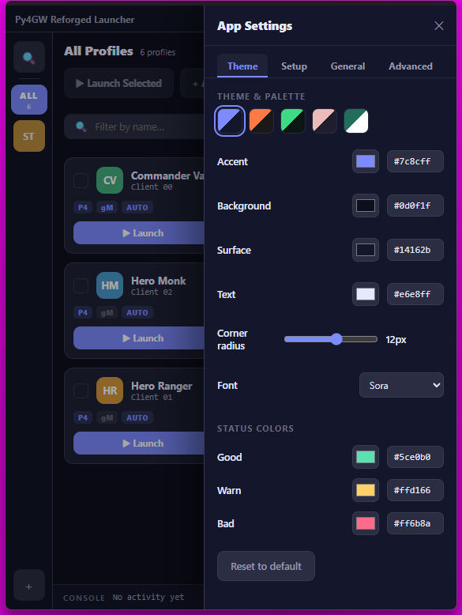
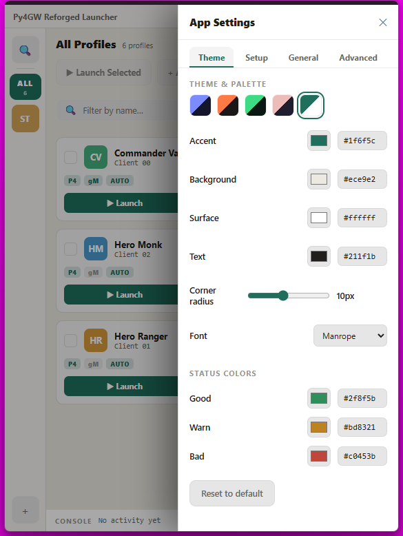
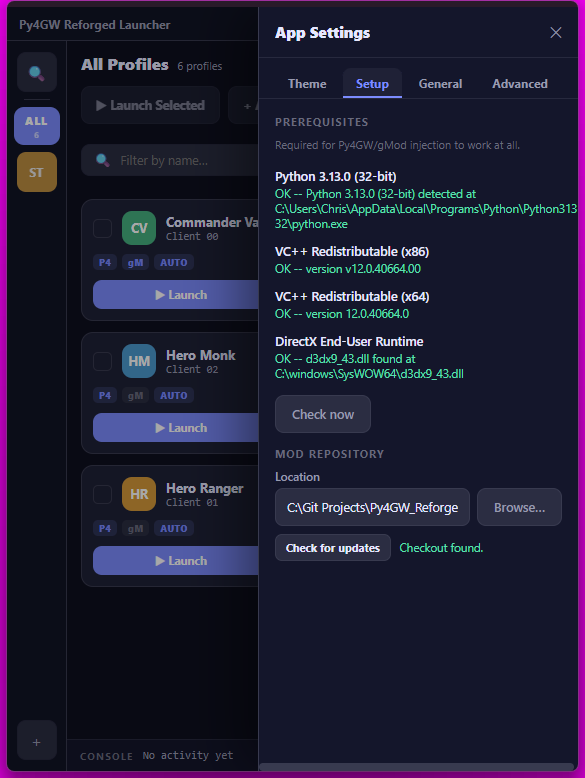
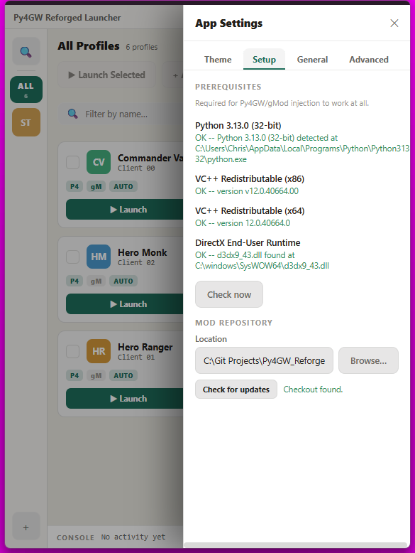

# Py4GW_Reforged_Launcher

A standalone desktop launcher for Guild Wars 1 with Py4GW injection, built
around multibox/HeroAI workflows — one human account plus up to several
AI-piloted "hero" accounts launched and paced together as a team.

The launcher also bootstraps its own dependencies: on a machine with nothing
installed, it detects and installs the Python runtime, VC++ redistributables,
and DirectX runtime it needs, then clones/updates the Py4GW_Reforged mod repo
itself. No manual Python or git setup required to get from a bare machine to
an injected GW1 session.

> **Status: alpha.** Built and tested by the two of us across two machines,
> plus live multi-account playtesting that's already surfaced and fixed real
> bugs. Nothing here is vaporware — every flow below has been run for real —
> but it hasn't had other hands on it yet. CI builds the `.exe` and runs the
> real test suite on every push, but real automated test coverage is narrow:
> 22 unit tests cover the window edge-drag/snap-zone geometry, nothing else.

## Screenshots

| | Dark | Light |
|---|---|---|
| Main window |  |  |
| Theme & palette |  |  |
| Setup & prerequisites |  |  |

(Account names shown are placeholders — no real accounts or credentials in
any of these.)

## What works today

- **Prerequisite bootstrap** — detects missing Python 3.13 (32-bit), VC++
  redistributables (x86 + x64), and the DirectX End-User Runtime; installs
  each on request and re-verifies with no restart needed. Validated
  end-to-end on a genuinely clean machine, all the way through a real
  injected GW1 launch. A launch that actually needs Py4GW injection gets
  gated with a real warning (not a silent failure) if something's still
  missing — "Launch anyway" is always one click away, never a hard block.
- **Mod repo management** — clones and updates the Py4GW_Reforged repo
  directly from the app, including into a completely empty folder.
- **GW1 launch + Py4GW injection** — auto-login, character selection,
  windowed/fullscreen toggle, GW1 client window retitling, multiclient
  patch support. A failed injection that leaves the real game process alive
  (rather than a clean failure) is detected and offers Stop, not another
  Launch — no accidental duplicate clients.
- **Multibox team launch** — group accounts into named teams, launch a
  whole team with a paced, staggered login sequence (anti-bot-safe timing,
  not a naive loop).
- **gMod injection** — per-profile mod lists (add/remove `.tpf` files in
  the Mods tab), independent per account even when several accounts share
  one GW install. Opt-in alongside Py4GW injection, not a replacement.
- **Click a card to focus its game window** — brings that profile's real
  running client to the foreground and marks the card as focused; the
  reverse works too — Alt-Tabbing or clicking a game window directly
  updates the card grid to match, live, with no click needed in the app.
- **Run as administrator** — an explicit, opt-in App Settings toggle (never
  automatic/silent). Elevates the launcher itself so every client launched
  that session inherits it too — real fix for clients installed under a
  UAC-protected path like `Program Files`. A persistent "ADMIN" badge shows
  whenever the running session actually is elevated.
- **Legacy `accounts.json` import** — bring accounts in directly from the
  old Python launcher's data, including team structure, with a real
  warning list for anything the old format carried that doesn't have a
  home here (GWToolbox++ settings, `run_as_admin`, auto-run scripts).
- **Roster backup/restore** — export and reimport your full profile/team
  setup, for moving between machines. Passwords are opt-in and clearly
  labeled plaintext when included (backups aren't a place to be vague
  about that).
- **App Settings, as a real tabbed drawer** — Theme, Setup, General, and
  Advanced, not one long scroll:
  - **Theme** — every palette color (accent, background, surface, text,
    plus the good/warn/bad status colors) is live-editable via swatch or
    hex field, on top of 5 built-in presets, with a one-click reset. Your
    palette actually survives an app restart.
  - **Setup** — prerequisites and mod repository, in one place.
  - **General** — launch pacing, master injection switches.
  - **Advanced** — backup/restore, run-as-admin, version display.
- **Live console panel** — a docked, collapsible view of launch/injection
  log output as it happens, color-coded by real category (success/warning/
  error/informational), not a flat log dump.
- **Dark/light theme**, DPI-aware sizing, and a card-grid UI (not a dense
  always-expanded account form).

## Getting it

The launcher is a standalone Python/pywebview app, but its own data and
the built `.exe` both live inside this repo — not a separate distribution
channel. Get the repo however you'd normally get it (`git clone`/`pull`,
or a ZIP download both work), and:

**Just run the `.exe`:** `Py4GW_Reforged_Launcher.exe` sits at the actual
repo root, committed and updated alongside the code. If Windows blocks it
on first run (Smart App Control / SmartScreen — expected for an unsigned
binary from a small project), right-click the `.exe` → Properties →
Unblock, then run it again.

**Or build from source** (if you're changing the launcher's own code, or
just prefer it):

```
py -3.13-32 -m venv .venv
.venv\Scripts\pip install --only-binary=:all: --no-binary=proxy_tools -r requirements.txt
.venv\Scripts\python.exe -m pywebview_shell.run_shell
```

(32-bit Python is required — GW1's `Gw.exe` is a 32-bit process, and the
injection pipeline needs matching bitness. `proxy_tools`, one of
`pywebview`'s own dependencies, only ships an sdist — it's pure Python, so
installing it from source needs no compiler.)

Profile/team data lives at `Settings/Py4GW_Reforged_Launcher/accounts.json`
inside your checkout — the same on-disk format the old standalone
launcher used, so this app can read an existing one directly on first run
with no manual import step.

## Quick tour

If you're checking this out for the first time, a fast path through the
core flows:

1. Launch the app — if anything's missing (Python/VC++/DirectX), the
   Setup tab in App Settings will offer to install it.
2. Add a profile (character name, email/password, GW1 install path).
3. Launch that profile solo and confirm Py4GW injects cleanly.
4. Create a team, add 2+ profiles to it, and launch the team — watch the
   staggered/paced login.
5. Open App Settings → Theme and try editing a color live — it applies
   instantly and survives a restart.
6. Back up your accounts (App Settings → Advanced) before making any risky
   changes — it's a plain JSON export, real Save-As dialog.

## Advanced

A couple of settings live only in `launcher_settings.json` (under
`Settings/Py4GW_Reforged_Launcher/` inside your checkout, alongside
`accounts.json`) with no in-app UI control — most people will never need
to touch these, but they're there as a manual escape hatch. (The mod
repository's own local *path* has a real Browse button in App Settings →
Setup; this is a different, rarer setting.)

- `mod_repo_url` — where the Py4GW_Reforged mod code itself is cloned and
  updated from. Defaults to the upstream repo.

Read fresh on the next use, no restart needed — just add or edit the key
by hand and save the file. (`launcher_release_repo`, a sibling setting
from when this launcher shipped discrete GitHub Releases, is currently
unused — no UI checks it anymore now that the `.exe` lives in the repo
itself; see `launcher_core/update_check.py`'s own note if that ever
changes.)

Feedback welcome on any of it — this is genuinely meant to become the
launcher for the project, not a side experiment.
