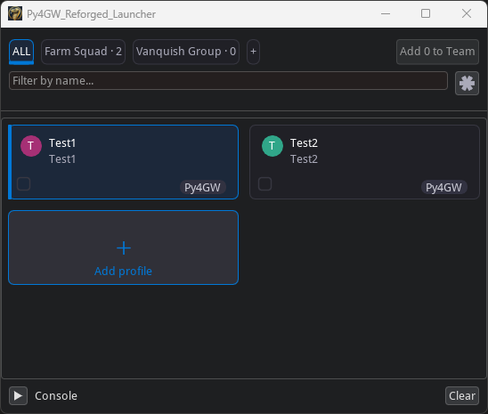
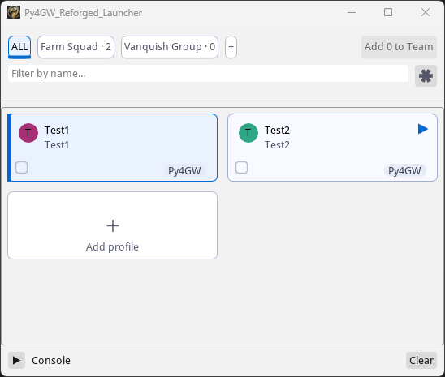
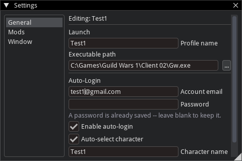
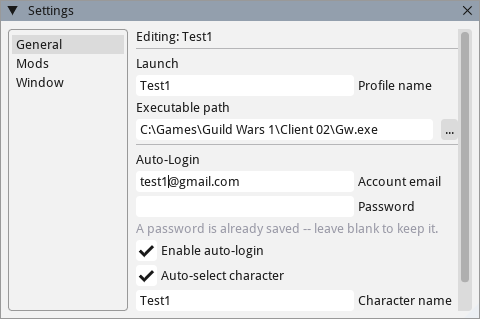
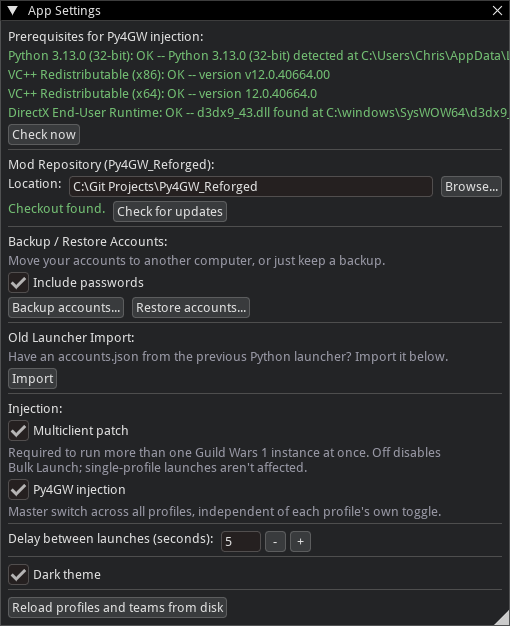
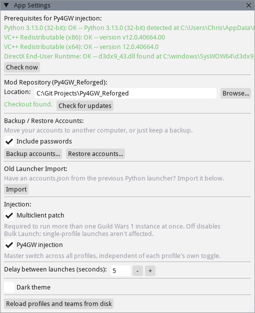

# Py4GW_Reforged_Launcher

A standalone desktop launcher for Guild Wars 1 with Py4GW injection, built
around multibox/HeroAI workflows — one human account plus up to several
AI-piloted "hero" accounts launched and paced together as a team.

The launcher also bootstraps its own dependencies: on a machine with nothing
installed, it detects and installs the Python runtime, VC++ redistributables,
and DirectX runtime it needs, then clones/updates the Py4GW_Reforged mod repo
itself. No manual Python or git setup required to get from a bare machine to
an injected GW1 session.

> **Status: alpha.** Built and tested by the two of us across two machines.
> Nothing here is vaporware — the flows below have all been run for real —
> but it hasn't had other hands on it yet, and there's no automated test
> suite or CI behind it.

## Screenshots

| | Dark | Light |
|---|---|---|
| Main window |  |  |
| Profile settings |  |  |
| App settings |  |  |

## What works today

- **Prerequisite bootstrap** — detects missing Python 3.13 (32-bit), VC++
  redistributables (x86 + x64), and the DirectX End-User Runtime; installs
  each on request and re-verifies with no restart needed. Validated
  end-to-end on a genuinely clean machine, all the way through a real
  injected GW1 launch.
- **Mod repo management** — clones and updates the Py4GW_Reforged repo
  directly from the app, including into a completely empty folder.
- **GW1 launch + Py4GW injection** — auto-login, character selection,
  windowed/fullscreen toggle, GW1 client window retitling, multiclient
  patch support.
- **Multibox team launch** — group accounts into named teams, launch a
  whole team with a paced, staggered login sequence (anti-bot-safe timing,
  not a naive loop).
- **Legacy `accounts.json` import** — bring accounts in directly from the
  old Python launcher's data, including team structure.
- **Roster backup/restore** — export and reimport your full profile/team
  setup, for moving between machines.
- **Live console panel** — a docked, collapsible view of launch/injection
  log output as it happens.
- **Dark/light theme**, DPI-aware sizing, and a card-grid UI (not a dense
  always-expanded account form).

## Not yet built

- gMod injection and mod-selection UI
- GW1 client auto-update/patching
- Name-obfuscation config delivery to the injected DLL (the hook point
  exists; the feature behind it doesn't yet)

## Getting it

The launcher is a standalone Python/ImGui app — its code and data are
entirely separate from the rest of this repo. Profile/team data lives
under `%APPDATA%\Py4GW_Reforged_Launcher\`, not inside the repo folder.

**Build from source (recommended for now):** the packaged `.exe` isn't
code-signed yet, so Windows Smart App Control may flag a downloaded build
as unrecognized. Building from source avoids that entirely:

```
py -3.13-32 -m venv .venv
.venv\Scripts\pip install --only-binary=:all: -r requirements.txt
.venv\Scripts\python.exe launcher.py
```

(32-bit Python is required — GW1's `Gw.exe` is a 32-bit process, and the
injection pipeline needs matching bitness. See `requirements.txt`'s header
for a wheel-availability note on `imgui-bundle`.)

**Or grab a built `.exe`:** if you'd rather not build from source, ask for
a release build directly. If Windows blocks it on first run (Smart App
Control / SmartScreen — expected for an unsigned binary from a small
project), right-click the `.exe` → Properties → Unblock, then run it again.

## Quick tour

If you're checking this out for the first time, a fast path through the
core flows:

1. Launch the app — if anything's missing (Python/VC++/DirectX), the
   prerequisite check will offer to install it.
2. Add a profile (character name, email/password, GW1 install path).
3. Launch that profile solo and confirm Py4GW injects cleanly.
4. Create a team, add 2+ profiles to it, and launch the team — watch the
   staggered/paced login.
5. If you have an `accounts.json` from the old launcher handy, try the
   import.

## Advanced

A couple of settings live only in `launcher_settings.json` (under
`%APPDATA%\Py4GW_Reforged_Launcher\`) with no in-app UI control — most
people will never need to touch these, but they're there as a manual
escape hatch:

- `mod_repo_url` — where the Py4GW_Reforged mod code itself is cloned and
  updated from. Defaults to the upstream repo.
- `launcher_release_repo` (`owner/repo` form, e.g. `apoguita/Py4GW_Reforged`)
  — which GitHub repo the "Check for updates" feature in App Settings
  checks releases against. Also defaults to upstream; a fork can override
  this to point update-checks at its own releases instead.

Both are read fresh on the next check/use, no restart needed — just add or
edit the key by hand and save the file.

Feedback welcome on any of it — this is genuinely meant to become the
launcher for the project, not a side experiment.
